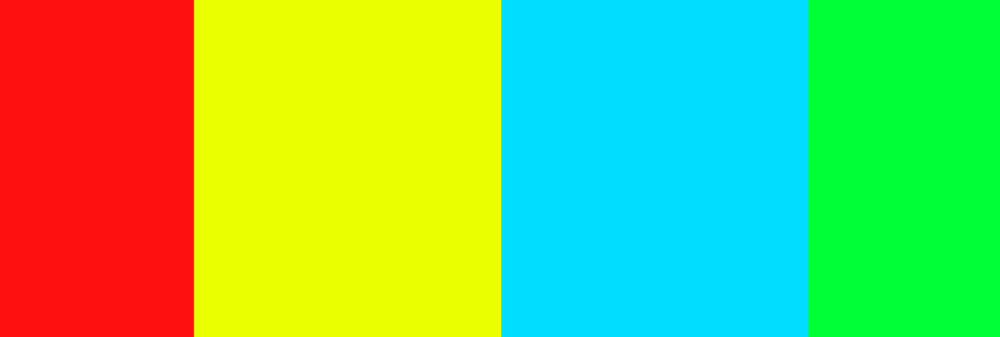

# HANGMAN

- You play game here [here](https://hangman-wl.herokuapp.com/)..

# Aim of Game

The goal of this Game is to create an interactive word game that is both fun a challenging for the user. It will be programmed entirely in Python and run on Code Institute Huroko app. I picked hangman as it a popular word game that i enjoyed playing as a child with just a pen and paper. If you are not familiar with the game check it out here [find out more](https://en.wikipedia.org/wiki/Hangman_(game)) I have put a modern twist on an old game by using python code. Word games are loved all over the world by both kids and adults and have and have shown to have a number of great benefits for the user [find out more](https://www.wordunscramble.io/articles/benefits-of-playing-word-games) It is also a cool way for a developer or even a full stack student to relax and enjoy a few word games in-between dealing with coding challenges.

# How to Play
  - The aim of the game is to guess the hidden word that is generated at random by the game
  - The word will be shown the the user  with _ _ _ _ _ to show user how many letters are in the word
  - The user will have 7 tries or lives to guess the hidden word.
  - After each guess the user will get feed back weather they have guessed correctly or incorrectly. If they have guessed correctly the the letter will be revaled in the hidden word A P _ _ E
  - If user guesses incorrectly they will be notified of incorrect guess and they will lose a life. They will also get a visual representaiton of a hangman image been built for every life lost
  - Game is over when either all the users lives have gone or if the user correctly guesses the word

  

# User Stories
  The target audience for this game is both adults and kids as both demopgrhics enjoy word games, I tried to strike a balance between fun and engaging and also challenging to the user.
  - As a  user, I want to quickly and easily navigate the game.
  - As a user, I want to know the rules of the game.
  - As a user, i want the game to be fun and easy to play.
  - As a user, i want the game to be challenging.

# Features 

 __Start Screen__
 - The user is initially greeted by an bold hangman graphic in yellow.This Asci Art banner was created at [Asci banner](https://manytools.org/hacker-tools/ascii-banner/) A typewrite effect was added to keep user engaged, it gives a brief message there can only be one winner, and asks the user for their name. 
  
    

  - The user enters name and is greeted with some more text also in type writer effect, this was added to create engagement with the user and makes them feel part of the game it’s also a bit of fun.

    
  
  - The user must enter a valid name, error handling is put in place to ensure they do, they will be notified if not valid input.

    

__Game Menu__
 
  - After the start up screen The terminal is cleared and the player is brought to the main menu of the game. The palyer has 3 options to chose from.1.Hangman Rules 2.Start Game 3.Exit Game

      

  - The Hangman Rules section outlines the rules of the game, this text is delivered in a type writer effect to amke it more engaging to the user.

     

  - The Exit Game option will allow the user to completely terminate the game

      

  - Error handling menu,The user will be notified of an invalid selection on the menu screen

      

  - Error handling hangman rules.The user will be notified of an invalid selection on the hangman rules section

      

__Main Game__

  - At game start screen, the user is greeted with a bright game interface. It displays the current users lives, What letters he has guessed, (current nothing displayed as game has yet to start) What the Hidden word is _ _ _ _  that is randomly selected form a directory of over 400 words.
  The screen also asks the user to guess a letter. I also included asci art in to the lives dictionary to display at the opening screen of the game saying Good Luck.

    

  - Each user guess is recorded in you have used these letters. Every time they guess wrong thy lose a life and the hangman visual builds. The user also gets a message in red telling them that letter is not in the word.

    

  - When the user guesses a correct letter in the hidden word. the letter is revealed in current word, And get notfied of correct guess in terminal also in green text.

    

  - Clear terminal in between each move was also integrated to improve user experience

  - If the user gets all the letters correct in the current word they win, And message you win will appear.

    

  - If the user loses all their lives & the hangman visual will be completed the hangman wins, and the game over message is displayed. The hidden word will also be revealed.

    

  - At the end of each game the user will be given an option to play again or not play again. If the user plays again the terminal is cleared for a new game and a new random word is picked. If the user decides not to play again, they will be brought back to the main menu.
    

  
__Error Handling Main Game__

  - If the user enters a guess that is not in the alphabet, an error warning will be returned to the user, invalid character

    

  - if the user guesses the same character of a previous guess, they will be given a warning, and prompted for another guess. 

    

- When the game is over the user must select either Y or N, if they don’t select this an error message will be displayed. 

      

# Design
 - Ascii Art
   - Ascii Banners were used both in the main game heading, And in the main game interface, it add a nice dimension to the the overall design as using python only can make a boring interface for the user

    

 - Color Palette
   - I imported colorama to python to add color to the design of the game, it helps improve user eperience and overall game play. Red was used to highlight any errors,invlaid inputs & lose banner.Green was used for correct guesses and win banner.

   - Yellow and Cyan colors were also used to improve the overall interface of the game design.

    

   - Hangman Visuals pictures also help animate the game and create an element of suspense

    

   

# Future Development

- Difficulty Levels
  - There will be 3 difficulty levels, Easy, Medium & Hard, Hard will have 4 lives, Medium 7 lives and easy 10 lives. This will make the game more challenging

- Leader Board
  - The game will have a points system the user will earn point for correct guesses at the end of the game the users score will be uploaded in to a high scores screen.        

- Word Themes 
  - Currently all the words are just random words, it would be interesting if the user could select a theme and the words were directly related to that, for example movies

# Testing

### Validator Testing 

 - HTML Validator
   - [W3C](https://validator.w3.org/) site was used to validate the **HTML** code.
   - A number of small errors were initially flagged up. Some duplicate tags were removed and I also had to rename a number of images. I also misplaced a link tag in the homepage, as I copied this page structure for the rest of the site i had to fix it on all of these pages also
     - [Erros From Validator Hompage](assets/readme/html-home-error.png)
     - [Erros From Validator Quizzes](assets/readme/error-validator-quizzes.png)
     - [Erros From Validator Triva Quiz](assets/readme/validaor-error-triva-quiz.png)

   

 ### All Pages are now error free see links below:

 
   - [Homepage](https://validator.w3.org/nu/?doc=https%3A%2F%2Fwlillisdev.github.io%2Fquiz-master%2Findex.html)
   - [Quizzes Page](https://validator.w3.org/nu/?doc=https%3A%2F%2Fwlillisdev.github.io%2Fquiz-master%2Fquizzes.html)
   - [Triva Quizz](https://validator.w3.org/nu/?doc=https%3A%2F%2Fwlillisdev.github.io%2Fquiz-master%2Fquizz-triva.html) Error because image is hidden until event happens
   - [Sport Quizz](https://validator.w3.org/nu/?doc=https%3A%2F%2Fwlillisdev.github.io%2Fquiz-master%2Fsport-quizz.html) Error because image is hidden until event happens
   - [Film Quizz](https://validator.w3.org/nu/?doc=https%3A%2F%2Fwlillisdev.github.io%2Fquiz-master%2Ffilm-quizz.html) Error because image is hidden until event happens
   - [Film Quizz](https://validator.w3.org/nu/?doc=https%3A%2F%2Fwlillisdev.github.io%2Fquiz-master%2Fmusic-quizz.html) Error because image is hidden until event happens
   - [Contact Us Page](https://validator.w3.org/nu/?doc=https%3A%2F%2Fwlillisdev.github.io%2Fquiz-master%2Fcontact-us.html)
   - [Thank You Page](https://validator.w3.org/nu/?doc=https%3A%2F%2Fwlillisdev.github.io%2Fquiz-master%2Fthank-you.html)

## CSS Validator
  - The [W3C](https://validator.w3.org/) was used to validate the **CSS** code
  - The website passed with no errors

  

  ### See links below for Results:

   - [CSS Test Results](https://jigsaw.w3.org/css-validator/validator?uri=https%3A%2F%2Fwlillisdev.github.io%2Fquiz-master%2Findex.html&profile=css3svg&usermedium=all&warning=1&vextwarning=&lang=en)

 
## Lighthouse
 - Lighthouse testing was carried out in Developer Tools in Chrome. Initially it gave a number of improvements and flagged up a number of images that needed to be reduced in size. Which was done.

 - The results were also skewed as the chrome extensions on my testing device was affecting the lighthouse results. The tests of all pages were redone in a incognito window and performance score increased.

 
 - [Quizzes Page lighthouse results](assets/readme/quizzes-pages-lighthouse.png) results are slightly down mainly due to the integration  of google maps api.
 - [Contact Us lighthoust results](assets/readme/contact-lighthouse-crop.png)

 ## JavaScript
 - The [JShint](https://jshint.com/) was used to validate the **JavaScrip** code
 - The results initally highlighted a few warnings.
     - [Erros From JShint](assets/readme/jshint-error.png)
     
 - Each item was addressed, The validation loop for the quizz was edited to remove eval as Jshint highlighted it could be harmful for security issues. And stack overflow suggested adding / /*jshint esversion: 6 */ to the notes this prevented this error.

 
 
## Manual Testing
  - All the site links were manually tested to see if they all worked ok and linked to the correct locations.
  - The form was checked that name and email were required, that the radio buttons functioned and that the submit button worked.
  - The site was further tested using feedback from mentor,family and friends who checked it on different  devices they had.
  - All of the page's features were tested on Google Chrome, Microsoft Edge, Mozilla Firefox, Safari, and Opera .
  - Google Chrome's Developer Tool was used to inspect page elements during the build and helped identify  and debug issues within the HTML and CSS.
  - The README.md was checked before final submission and links verified.

# Bugs

  - When deploying the game on Huroko at first it wouldn’t deploy because of an issue colorama. After some research i added colorama to the requirements.txt file and it deployed ok.
  - I used the type writer effect form youtube, it was defined originally as def typewriter(string) but as i already had imported string for the main game it was causing issues, so i redefined the function as def typewriter(line).
  - When testing the game it was noted that it was possbile for the user to not fill out the user name input, i inserted isalpha() to ensure that it only accecpted characters from the alphabet. 

  

  # Unfixed Bugs
  - I am aware there is a console.log Error with Permissions-Policy header: Unrecognized feature: 'interest-cohort'.From what i have researched this is a issue between Github and Google and has no effect on the sites performance.
  - I am aware the website has a lot of large rich images and although images were cropped and compressed it could lead to reduced speed until cached. I have experimented with next gen image formats but currently  they lack browser compatibility  so i just went with png compressed and cropped format for this site.

# Deployment

The site was created using Visual Studio Code and GitHub, and deployed to GitHub pages for testing using the below process:

 - Clicked on my respository for [wlillisdev/quizz-master](https://github.com/wlillisdev/quiz-master).
 - Clicked settings tab and navigated down to "pages"
 - Selected "Main" in branch drop down box.
 - Clicked "save" which produced the live link which can be viewed [here](https://wlillisdev.github.io/quiz-master/).. 

 ## Version Control
  - Git was used as the version control software. Commands such as git add ., git status, git commit and git push were used to add, save, stage and push the code to the GitHub repository.

## Cloning

1. On [GitHub](www.github.com), navigate to the main page of the repository.  [Click Here for Reposititory Link](https://github.com/wlillisdev/quiz-master)

2. Above the list of files, click Code.

3. click Use GitHub CLI, then click the copy icon.

4. Open Git Bash and change the current working directory to the location where you want the cloned directory.

5. Type git clone, and then paste the URL that was copied previously  in step 3.

6. Press Enter to create the local clone.

[git cloning steps with pictuers](https://docs.github.com/en/repositories/creating-and-managing-repositories/cloning-a-repository#cloning-a-repository-to-github-desktop)

# Credits

- ## Languages

  - [HTML5](https://en.wikipedia.org/wiki/HTML5)
  - [CSS](https://en.wikipedia.org/wiki/CSS)
  - [JavaScript](https://en.wikipedia.org/wiki/JavaScript)

- ## Content
   - The code for the contact us form was taken from the love running tutorial from [Code Institute](https://codeinstitute.net/ie/) and modified.
   - The icons used throughout the site were from [Font Awesome](https://fontawesome.com/)
   - Variour Youtube tutorial were used to help understand flexbox.
   - [Flexbox](https://www.youtube.com/watch?v=fYq5PXgSsbE)
   - Animated Text on home page from [bulldogpatch](https://codepen.io/bulldogpatch-the-sasster/pen/JjoyeGg)
   - Tutorials for Randon Fact generator from freecode camp ,learn web-dev & dev.to were used to inspire the generator.
   - YouTube videos from Eduonix Learning Solutions,Kevin Briggs & Web Dev Simplified were used as a base for the quizz.
   - Youtube videos about google maps api with javascript were followed from Traversy Media & Sam Codes.

    

-  ## Images
   - All images were taken from [Pexels](https://www.pexels.com/)

  
 -  ## Resources
    - [Stack Overflow](https://stackoverflow.com/)
    - [W3Schools](https://www.w3schools.com/)
    - [w3docs](https://www.w3docs.com/)
    - Notes & Videos from course work from [Code Institute](https://codeinstitute.net/ie/)

-  ## Tools
   - [Balsamiq](https://balsamiq.com/) - Used to create wireframes
   - [Google Fonts](https://fonts.google.com/) - Used to import fonts
   - [TinyPNG](https://tinypng.com/) - Used to compress images

-  ## Acknowledgements
 - Special thanks to my mentor Miguel Martinez
 for his help and guidance in the development of my project. Special thanks to my tutor Kasia and our regular class meeting’s and members of the awesome slack community

   # Conclusion
    - I would like to experiment more with javaScript but as i am only getting to grips with the language i kept the concept simple.
    - If I was to build this site again, I would spend more time on the wireframes and know exactly how to structure each section and element before i start.
    - If i had time i would like to add a timer function to the quizz.    
    - I would also learn to make more commits during the project built.

