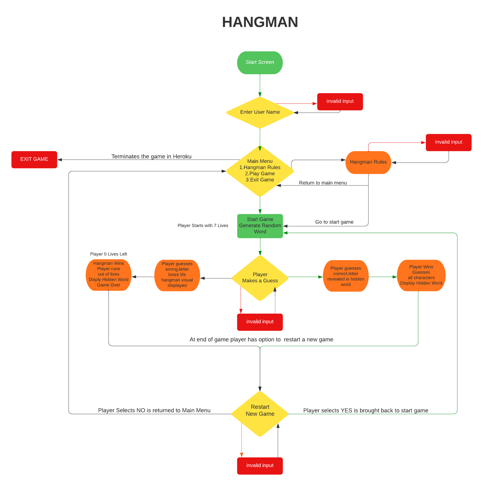
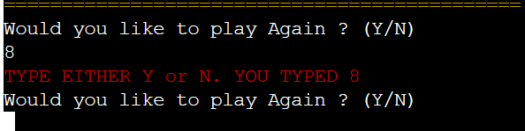

# HANGMAN

- You can view live game here [here](https://hangman-wl.herokuapp.com/)..

# Aim of Game

The goal of this Game is to create an interactive word game that is both fun a challenging for the user. It will be programmed entirely in Python and run on Code Institute Huroko app. I picked hangman as it a popular word game that i enjoyed playing as a child with just a pen and paper. If you are not familiar with the game check it out here [find out more](https://en.wikipedia.org/wiki/Hangman_(game)) I have put a modern twist on an old game by using python code. Word games are loved all over the world by both kids and adults and have shown to have a number of great benefits for the user [find out more](https://www.wordunscramble.io/articles/benefits-of-playing-word-games) It is also a cool way for a developer or even a full stack student to relax and enjoy a few word games in-between dealing with coding challenges.

# How to Play
  - The aim of the game is to guess the hidden word that is generated at random by the game
  - The word will be shown the the user  with _ _ _ _ _ to show user how many letters are in the word
  - The user will have 7 tries or lives to guess the hidden word.
  - After each guess the user will get feed back weather they have guessed correctly or incorrectly. If they have guessed correctly the the letter will be revaled in the hidden word A P _ _ E
  - If user guesses incorrectly they will be notified of incorrect guess and they will lose a life. They will also get a visual representaiton of a hangman image been built for every life lost
  - Game is over when either all the users lives have gone or if the user correctly guesses the word

  

# User Stories
  The target audience for this game is both adults and kids as both demopgrhics enjoy word games, I tried to strike a balance between fun and engaging and also challenging to the user.
  - As a  user, I want to quickly and easily navigate the game.
  - As a user, I want to know the rules of the game.
  - As a user, i want the game to be fun and easy to play.
  - As a user, i want the game to be challenging.

# Flow Chart
The flow chart was devloped to outline the logic of the game and help me programme it.I used [Luid Charts](https://bit.ly/3hXPmbj)

# Features 

 __Start Screen__
 - The user is initially greeted by an bold hangman graphic in yellow.This Asci Art banner was created at [Asci banner](https://manytools.org/hacker-tools/ascii-banner/) A typewrite effect was added to keep user engaged, it gives a brief message there can only be one winner, and asks the user for their name. 
  
    

  - The user enters name and is greeted with some more text also in type writer effect, this was added to create engagement with the user and makes them feel part of the game it’s also a bit of fun.

    
  
  - The user must enter a valid name, error handling is put in place to ensure they do, they will be notified if not valid input.

    

__Game Menu__
 
  - After the start up screen The terminal is cleared and the player is brought to the main menu of the game. The palyer has 3 options to chose from.1.Hangman Rules 2.Start Game 3.Exit Game

      

  - The Hangman Rules section outlines the rules of the game, this text is delivered in a type writer effect to amke it more engaging to the user.

     

  - The Exit Game option will allow the user to completely terminate the game

      

  - Error handling menu,The user will be notified of an invalid selection on the menu screen

      

  - Error handling hangman rules.The user will be notified of an invalid selection on the hangman rules section

      

__Main Game__

  - At game start screen, the user is greeted with a bright game interface. It displays the current users lives, What letters he has guessed, (current nothing displayed as game has yet to start) What the Hidden word is _ _ _ _  that is randomly selected form a directory of over 400 Kyle Ying.
  The screen also asks the user to guess a letter. I also included asci art in to the lives dictionary to display at the opening screen of the game saying Good Luck.

    

  - Each user guess is recorded in you have used these letters. Every time they guess wrong thy lose a life and the hangman visual builds. The user also gets a message in red telling them that letter is not in the word.

    

  - When the user guesses a correct letter in the hidden word. the letter is revealed in current word, And get notfied of correct guess in terminal also in green text.

    

  - Clear terminal in between each move was also integrated to improve user experience

  - If the user gets all the letters correct in the current word they win, And message you win will appear.

    

  - If the user loses all their lives & the hangman visual will be completed the hangman wins, and the game over message is displayed. The hidden word will also be revealed.

    

  - At the end of each game the user will be given an option to play again or not play again. If the user plays again the terminal is cleared for a new game and a new random word is picked. If the user decides not to play again, they will be brought back to the main menu.

    
  
__Error Handling Main Game__

  - If the user enters a guess that is not in the alphabet, an error warning will be returned to the user, invalid character

    

  - if the user guesses the same character of a previous guess, they will be given a warning, and prompted for another guess. 

    

  - When the game is over the user must select either Y or N, if they don’t select this an error message will be displayed. 

      

# Design
 - Ascii Art
   - Ascii Banners were used both in the main game heading, And in the main game interface, it adds a nice dimension to the the overall design as using python only can make a boring interface for the user

    

 - Color Palette
   - I imported colorama to python to add color to the design of the game, it helps improve user eperience and overall game play. Red was used to highlight any errors,invlaid inputs & lose banner.Green was used for correct guesses and win banner. This can be seen in the featuers section.

   - Yellow and Cyan colors were also used to improve the overall interface of the game design.

    

   - Hangman Visuals pictures also help animate the game and create an element of suspense for the user and give a traditional element to the game.

    

# Future Development

- Difficulty Levels
  - There will be 3 difficulty levels, Easy, Medium & Hard, Hard will have 4 lives, Medium 7 lives and easy 10 lives. This will make the game more challenging

- Leader Board
  - The game will have a points system the user will earn points for correct guesses at the end of the game the users name and score will be uploaded in to a high scores screen.        

- Word Themes 
  - Currently the word list is just random words. it would be interesting if the user could select a theme for example movies and all the words would be related to movies.

# Testing

### Validator Testing 

 - Pep 8 Testing
   - [pep8 online](http://pep8online.com/)  was used for validating the python files. 
   - Initally there was a number of errors , all errors were fixed
     - [Inital Erros From Pep 8](images_readme/pep8.png)

  - Pep 8 Pass Test

    - 
   
## Manual Testing
  - Continuous testing was carried out in git pod terminal and on the Heroku terminal during the game development. Methods such as print() was used as the code was been developed I used this to check for errors during the build.
  - I Manually tested user inputs by purposefully inputting incorrect data to confirm error messages were working properly. I have previously outlined the error handling inputs in the features section.
  - Errors or warnings were fixed as they appeared such as indentation errors, lines too long or extra space issues.
  - Before the game was sent for feedback, i tested everything on the Heroku terminal multiple times.
  - The game was further tested using feedback from mentor, family and friends who played it and gave feedback on any issues they had.

# Bugs

  - When deploying the game on Huroko at first it wouldn’t deploy because of an issue with colorama. After some research i added colorama to the requirements.txt file and it deployed ok.
  - I used the type writer effect form YouTube tutorial, it was defined originally as def typewriter(string) but as i already had imported python libary string for the main game it was causing issues, so i redefined the function as def typewriter(line).
  - When testing the game it was noted that it was possible for the user to not fill out the user name input, i inserted isalpha() to ensure that it only accepted characters from the alphabet.
  - When playing the game I noticed that every guess and hangman visual was appearing in the terminal and if you restarted the game the terminal became very busy and clutterd. I research that using a clear os.system function would get rid of the issue and make a cleaner and more user friendly interface by clearing each screen on the terminal after each guess. I used this function throughout the build once it was defined to make a cleaner and more user friendly game.

  # Unfixed Bugs
  - I am aware there is pep 8 errors in the hangman _lives files, this is a result of ascii banner inserted and some manual edits, it is giving a trailing whitespace warning, I discussed this with my mentor and tutor support, there was no straight forward fix, it has no effect on the game performance, and I chose to leave it is as I thought it was good feature for user experience.

# Deployment

The site was created using Visual Studio Code in Gitpod and GitHub, and deployed to Heroku pages using the below process:

1. Remove un-wanted import features in run.py file
2. Add to requirements.txt file:-
* pip3 freeze > requirements.txt
* Commit and push all changes to Github:

Next I Created an new account in Heroku, And the follows steps were done

1.	First I must create a new app to do this, click NEW in the top right corner and from the drop-down menu select Create a new APP.
2.	You must create an app name, (hangman_wl) Heroku requires a unique name.
3.	Select the region Europe.
4.	Click on the Create App button.
5.	The next page you will see is the project’s Deploy Tab.  Click on setting tab and scroll down to config vars.
6.	Scroll down to Config Vars where and need to enter the KEY: PORT and VALUE: 8000 I have no creds.json files for my project.
7.  Press Add-button
8.	Scroll down to Buildpacks and press the icon for Python, click Save Changes, then press the icon for Nodejs and save changes. Note These Buildpacks must be in the order of Python first and Nodejs second.
9.	Scroll to the top of the page and now choose the Deploy tab
10.	Select Github as the deployment method.
11.	Confirm you want to connect to GitHub.
12.	Search for the repository name and click the connect button.
13.	Scroll to the bottom of the deploy page and select preferred deployment method.
14. I clicked on Automatic Deployment so that my changes that I pushed to github are automatically updates in Heroku as i was still testing and building the game at this point.
15. Then in the Manual Deploy section, press Deploy Branch.
16. After project has been deployed successfully I clicked the View-button to see the program run in the terminal and checked it it worked ok.

 ## Version Control
  - Git was used as the version control software. Commands such as git add ., git status, git commit and git push were used to add, save, stage and push the code to the GitHub repository.

## Cloning

1. On [GitHub](www.github.com), navigate to the main page of the repository.  [Click Here for Reposititory Link](https://github.com/wlillisdev/hangman)

2. Above the list of files, click Code.

3. click Use GitHub CLI, then click the copy icon.

4. Open Git Bash and change the current working directory to the location where you want the cloned directory.

5. Type git clone, and then paste the URL that was copied previously  in step 3.

6. Press Enter to create the local clone.

[git cloning steps with pictuers](https://docs.github.com/en/repositories/creating-and-managing-repositories/cloning-a-repository#cloning-a-repository-to-github-desktop)

## Forking

- Use the following steps if you want to fork this project.

1. Open [GitHub](https://github.com/)
2. Click on the project to be forked
3. Find the Fork button at the top right of the page
4. Once you click the button the fork will be in your repository

# Credits

- ## Languages

  - [Python](https://en.wikipedia.org/wiki/Python_(programming_language))

- ## Content For Build
   - The basic game was inspired from various youtube tutorials i researched at the start of the build. Espically the tutorials from 
    - [Kite](https://www.youtube.com/watch?v=m4nEnsavl6w)
    - [Kyle Ying](https://www.youtube.com/watch?v=cJJTnI22IF8),
    - [CBT Nuggets](https://www.youtube.com/watch?v=JNXmCOumNw0)
    - [Tech With Mike](https://www.youtube.com/watch?v=Ff--def_1q0)
   - The random word list was taken from kite.
   - The base hangman visuals were taken from Kyle Ying and modified by me.
   - The type writer effect was inspired by [Kwasii](https://www.youtube.com/watch?v=A_1THfBpCH8)

-  ## Python Libraries
    - random
      - The random library was imported to generate a random word from the word.py file, each new game has a different random word.
    - os
      - The os library was imported to create a function to use the os.system to clear the terminal screen.
    - sys
      - The sys library was imported to create a function that allows the user to exit the game.
    - time
      - The time() function returns the number of seconds passed since epoch and was used to make the type write effect function.
    - string
      - The import string was used to define a constants set of ascii_letters in the alphabet which was used to define a set of characters that the user could only guess from in the main game function.
    - colorama
      - colorama was used to apply different colors in the games interface and improve error handling.

 -  ## Resources
    - [Stack Overflow](https://stackoverflow.com/)
    - [W3Schools](https://www.w3schools.com/)
    - [w3docs](https://www.w3docs.com/)
    - Notes & Videos from course work from [Code Institute](https://codeinstitute.net/ie/)

-  ## Tools
   - [Ascii Art](https://manytools.org/hacker-tools/ascii-banner/) - Used to create Ascii Banners
   - [Luid Charts](https://bit.ly/3hXPmbj) - used for flow
   

-  ## Acknowledgements
 - Special thanks to my mentor Miguel Martinez for his help and guidance in the development of my project. Special thanks to my tutor Kasia and our regular class meeting’s and members of the awesome slack community

   # Conclusion
    - If I had time, I would like to add a high scores table using the tutorial of love sandwiches as a base.    
    - I would also like to make more commits during the project built.
    - Overall, I enjoyed python and I have shortlisted a number of other projects i came across when in the research phase for the project that I would like to build after this course.

